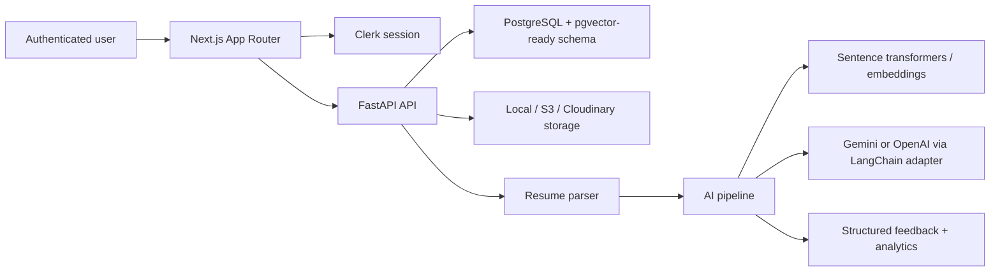

# Nexora AI

A production-style full-stack AI SaaS platform for students and job seekers. It combines resume analysis, ATS scoring, job-description matching, AI mock interviews, skill-gap diagnosis, learning roadmaps, analytics, authentication, PostgreSQL persistence, and deployment-ready architecture.

## Stack

- Frontend: Next.js App Router, TypeScript, Tailwind CSS, shadcn-style UI primitives, Framer Motion, Recharts, Clerk
- Backend: FastAPI, SQLAlchemy 2.0, PostgreSQL, LangChain-compatible AI services
- AI/NLP: provider abstraction for Gemini/OpenAI, sentence-transformer embeddings with deterministic fallbacks, semantic similarity, structured feedback pipelines
- Storage: local storage in development with Cloudinary/S3 extension points
- Deployment: Vercel frontend, Render/Railway backend, Neon/Supabase/PostgreSQL database

## Product Modules

- Resume analyzer: PDF/text parsing, section extraction, ATS score, grammar/formatting checks, keyword and semantic skill analysis
- JD matcher: resume-to-job semantic match percentage, missing skills, optimization roadmap
- AI mock interview: role, difficulty, interview type, adaptive follow-ups, answer scoring, feedback history
- Learning engine: personalized roadmap based on resume gaps and interview performance
- Analytics dashboard: ATS trends, interview performance, skill coverage, match percentages, weak areas
- User profile: target role, skill inventory, profile metadata, resume/interview history

## Quick Start

1. Copy environment variables:

```bash
cp .env.example .env
```

2. Start PostgreSQL and the API with Docker:

```bash
docker compose up postgres api
```

3. In another terminal, install and run the frontend:

```bash
npm install
npm run dev
```

4. Open `http://localhost:3000`.

The app works in demo mode with deterministic AI responses when `AI_PROVIDER=mock`. Configure `OPENAI_API_KEY` or `GOOGLE_API_KEY` and set `AI_PROVIDER=openai` or `AI_PROVIDER=gemini` for live LLM output.

## Backend

```bash
cd apps/api
python -m venv .venv
source .venv/bin/activate
pip install -e ".[dev]"
uvicorn app.main:app --reload --port 8000
```

API docs are available at `http://localhost:8000/docs`.

Important endpoints:

- `POST /api/v1/resumes/analyze`
- `POST /api/v1/job-matches/analyze`
- `POST /api/v1/interviews/start`
- `POST /api/v1/interviews/answer`
- `POST /api/v1/learning/roadmap`
- `GET /api/v1/analytics/overview`

## Architecture



The AI layer is intentionally not a chatbot wrapper. Each workflow has its own pipeline:

- Resume pipeline: parse, segment, extract skills, run formatting checks, compute ATS dimensions, call LLM for structured coaching.
- Matching pipeline: compare resume and JD with semantic similarity, keyword coverage, role-skill ontology, and weighted scoring.
- Interview pipeline: generate calibrated question sets, evaluate answers with rubrics, adapt follow-ups, and persist analytics.
- Learning pipeline: merge weak areas across resumes, JD matches, and interviews into a prioritized roadmap.

## Deployment

Frontend on Vercel:

- Root directory: `apps/web`
- Build command: `npm run build`
- Output: Next.js default
- Required env: `NEXT_PUBLIC_API_URL`, Clerk keys

Backend on Render/Railway:

- Root directory: `apps/api`
- Start command: `uvicorn app.main:app --host 0.0.0.0 --port $PORT`
- Required env: `DATABASE_URL`, `BACKEND_CORS_ORIGINS`, AI provider keys

Database on Neon/Supabase:

- Use a PostgreSQL connection string.
- Enable `pgvector` when available for future vector persistence.

## Development Notes

- The web app uses typed API clients in `apps/web/services`.
- Backend services live under `apps/api/app/services`, separated from route handlers.
- SQLAlchemy models are indexed for user history and reporting queries.
- Rate limiting, CORS, structured error handling, and auth-aware dependencies are included.
- Docker and GitHub Actions are ready for deployment hardening.

## Additional Docs

- API reference: `docs/API.md`
- Architecture: `docs/ARCHITECTURE.md`
- Environment guide: `docs/ENVIRONMENT.md`
- Deployment guide: `docs/DEPLOYMENT.md`
